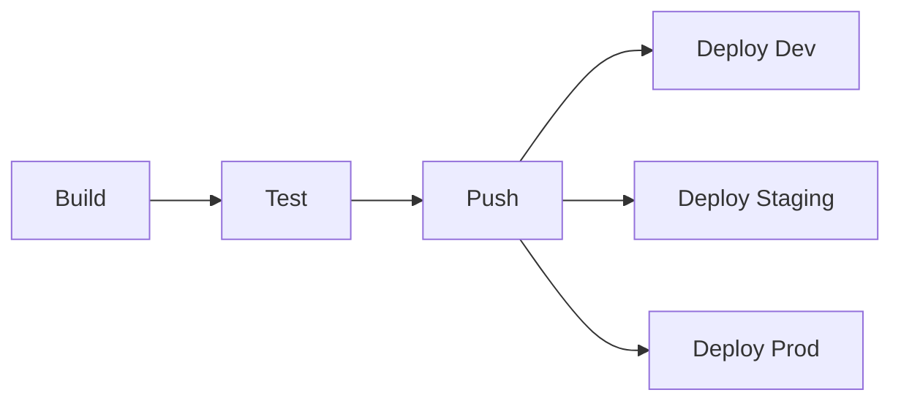

# EshopMicroservices Helm Chart

Production-ready Helm chart for deploying the EshopMicroservices .NET 8 application to IBM Cloud IKS (IBM Kubernetes Service).

## Table of Contents

- [Overview](#overview)
- [Architecture](#architecture)
- [Prerequisites](#prerequisites)
- [Quick Start](#quick-start)
- [Configuration](#configuration)
- [Deployment](#deployment)
- [GitLab CI/CD](#gitlab-cicd)
- [Monitoring](#monitoring)
- [Troubleshooting](#troubleshooting)
- [Maintenance](#maintenance)

## Overview

This Helm chart deploys a complete microservices application including:

**Application Services (7):**
- Catalog API - Product catalog management
- Basket API - Shopping cart management
- Ordering API - Order processing
- Discount gRPC - Discount calculation service (gRPC)
- YARP Gateway - API Gateway for routing
- Shopping Web - Customer-facing web application
- HealthDeck Web - Health monitoring dashboard

**Infrastructure Services:**
- PostgreSQL (2 instances) - CatalogDb, BasketDb
- SQL Server 2022 - OrderDb
- Redis - Caching and session storage
- RabbitMQ - Message broker for event-driven communication
- Elasticsearch - Centralized logging
- Kibana - Log visualization

## Architecture

```
┌────────────────────────────────────────────────────────────┐
│                    IBM Cloud IKS                            │
│   ┌────────────────────────────────────────────────┐       │
│   │              Ingress (ALB)                     │       │
│   └───────────────────┬────────────────────────────┘       │
│                       │                                     │
│   ┌───────────────────▼────────────────────────────┐       │
│   │          YARP API Gateway                      │       │
│   └──┬────────────┬────────────┬───────────────────┘       │
│      │            │            │                            │
│   ┌──▼──┐     ┌──▼──┐     ┌──▼──┐                         │
│   │Cat. │     │Bskt.│     │Ord. │                         │
│   │ API │     │ API │     │ API │                         │
│   └──┬──┘     └──┬──┘     └──┬──┘                         │
│      │            │            │                            │
│   ┌──▼──────┐ ┌──▼──────┐ ┌──▼──────┐                     │
│   │PG Catalog│ │PG Basket│ │SQL Order│                     │
│   └──────────┘ └────┬────┘ └──────────┘                    │
│                     │                                       │
│              ┌──────▼──────┐                                │
│              │ Redis Cache │                                │
│              └─────────────┘                                │
└────────────────────────────────────────────────────────────┘
```

## Prerequisites

### Tools Required

1. **IBM Cloud CLI** (with Kubernetes Service plugin)
   ```bash
   curl -fsSL https://clis.cloud.ibm.com/install/linux | sh
   ibmcloud plugin install kubernetes-service
   ```

2. **kubectl**
   ```bash
   # Installed automatically with IBM Cloud CLI
   ibmcloud ks cluster config --cluster lgharbi-eshop-cluster-k8s
   ```

3. **Helm 3.x**
   ```bash
   curl https://raw.githubusercontent.com/helm/helm/main/scripts/get-helm-3 | bash
   ```

### IBM Cloud Infrastructure

- **Cluster:** lgharbi-eshop-cluster-k8s (IKS)
- **Namespaces:** eshop-dev, eshop-staging, eshop-prod
- **Container Registry:** de.icr.io/eshop-images
- **Storage Classes:**
  - `ibmc-block-bronze` - 2 IOPS/GB (development)
  - `ibmc-block-silver` - 4 IOPS/GB (staging)
  - `ibmc-block-gold` - 10 IOPS/GB (production)

### GitLab CI/CD Variables

Configure in **GitLab → Settings → CI/CD → Variables**:

| Variable | Value | Protected | Masked |
|----------|-------|-----------|--------|
| `IBM_CLOUD_API_KEY` | Your IBM Cloud API key | ✓ | ✓ |
| `IBM_CLOUD_REGION` | us-south | - | - |
| `IKS_CLUSTER_NAME` | lgharbi-eshop-cluster-k8s | - | - |

## Quick Start

### 1. Clone and Navigate

```bash
git clone https://gitlab.com/your-org/eshop-microservices.git
cd eshop-microservices
```

### 2. Login to IBM Cloud

```bash
ibmcloud login --apikey YOUR_API_KEY
ibmcloud ks cluster config --cluster lgharbi-eshop-cluster-k8s
```

### 3. Verify Connection

```bash
kubectl get nodes
kubectl get namespaces | grep eshop
```

### 4. Deploy to Development

```bash
# Using Helm directly
helm upgrade --install eshop-dev ./deploy/helm/eshop-microservices \
  --namespace eshop-dev \
  --create-namespace \
  --values ./deploy/helm/eshop-microservices/values-dev.yaml \
  --set global.imageRegistry=de.icr.io/eshop-images \
  --wait

# OR using deployment script
cd scripts
./deploy-dev.sh latest
```

## Configuration

### Environment-Specific Values

The chart includes four values files:

1. **values.yaml** - Base configuration with defaults
2. **values-dev.yaml** - Development overrides
3. **values-staging.yaml** - Staging overrides
4. **values-prod.yaml** - Production overrides

### Key Configuration Sections

#### Global Settings

```yaml
global:
  namespace: eshop-dev
  environment: development
  imageRegistry: de.icr.io/eshop-images
  imageTag: latest
  imagePullPolicy: IfNotPresent
```

#### Service Replicas

```yaml
replicaCount:
  catalogApi: 2
  basketApi: 2
  orderingApi: 2
  yarpGateway: 2
```

#### Resources

```yaml
resources:
  catalogApi:
    requests:
      cpu: 100m
      memory: 256Mi
    limits:
      cpu: 500m
      memory: 512Mi
```

#### Database Configuration

```yaml
postgresql:
  enabled: true
  catalogDb:
    name: CatalogDb
    storageSize: 10Gi
    storageClass: ibmc-block-bronze
```

### Overriding Values

Use `--set` flags for quick overrides:

```bash
helm upgrade --install eshop-dev ./deploy/helm/eshop-microservices \
  --namespace eshop-dev \
  --set global.imageTag=v1.2.3 \
  --set replicaCount.catalogApi=5 \
  --set postgresql.catalogDb.storageClass=ibmc-block-gold
```

## Deployment

### Development Environment

**Trigger:** Push to `develop` branch

```bash
# Manual deployment
cd scripts
./deploy-dev.sh latest

# Or with specific tag
./deploy-dev.sh abc123
```

**Characteristics:**
- Namespace: `eshop-dev`
- Single replica for each service
- Minimal resources
- Bronze storage class
- Autoscaling: Disabled
- Network policies: Disabled

### Staging Environment

**Trigger:** Push to `main` branch

```bash
# Manual deployment
cd scripts
./deploy-staging.sh latest
```

**Characteristics:**
- Namespace: `eshop-staging`
- 2 replicas per service
- Medium resources
- Silver storage class
- Autoscaling: Enabled (2-4 replicas)
- Network policies: Enabled
- Pod Disruption Budgets: Enabled

### Production Environment

**Trigger:** Manual approval on git tags

```bash
# Manual deployment
cd scripts
./deploy-prod.sh v1.0.0
```

**Characteristics:**
- Namespace: `eshop-prod`
- 3+ replicas per service
- Production-grade resources
- Gold storage class (10 IOPS/GB)
- Autoscaling: Enabled (3-10 replicas)
- Network policies: Enabled
- Pod Disruption Budgets: Enabled (min 2 available)
- Anti-affinity rules

## GitLab CI/CD

### Pipeline Stages



### Workflow

1. **Build Stage:** Build all 7 Docker images
2. **Test Stage:** Run unit tests with .NET SDK
3. **Push Stage:** Push images to IBM Container Registry
4. **Deploy Stages:**
   - `develop` branch → Auto-deploy to `eshop-dev`
   - `main` branch → Auto-deploy to `eshop-staging`
   - Tags (v*) → Manual deploy to `eshop-prod`

### Creating a Release

```bash
# Create and push a tag
git tag -a v1.0.0 -m "Release version 1.0.0"
git push origin v1.0.0

# This triggers the pipeline
# Manual approval required for production deployment in GitLab UI
```

## Monitoring

### Health Checks

All services expose `/health` endpoints:

```bash
# Check pod status
kubectl get pods -n eshop-dev

# Check specific service health
kubectl exec -it deployment/eshop-dev-catalog-api -n eshop-dev -- curl http://localhost:8080/health
```

### Logs

#### View Application Logs

```bash
# Catalog API logs
kubectl logs -f deployment/eshop-dev-catalog-api -n eshop-dev

# All logs from a service
kubectl logs -f -l app.kubernetes.io/component=catalog-api -n eshop-dev
```

#### Kibana Dashboard

```bash
# Port-forward Kibana
kubectl port-forward svc/eshop-dev-kibana 5601:5601 -n eshop-dev

# Open browser: http://localhost:5601
```

### RabbitMQ Management UI

```bash
# Port-forward RabbitMQ management
kubectl port-forward svc/eshop-dev-rabbitmq 15672:15672 -n eshop-dev

# Open browser: http://localhost:15672
# Credentials: guest/guest (default)
```

### HealthDeck Dashboard

```bash
# Port-forward HealthDeck
kubectl port-forward svc/eshop-dev-healthdeck-web 8080:80 -n eshop-dev

# Open browser: http://localhost:8080
```

### Metrics

```bash
# CPU and Memory usage
kubectl top pods -n eshop-dev

# Detailed resource usage
kubectl describe pod <pod-name> -n eshop-dev
```

## Troubleshooting

### Pods Not Starting

```bash
# Check pod status
kubectl get pods -n eshop-dev

# Describe pod for events
kubectl describe pod <pod-name> -n eshop-dev

# Check logs
kubectl logs <pod-name> -n eshop-dev

# Check previous logs if pod restarted
kubectl logs <pod-name> -n eshop-dev --previous
```

### Common Issues

#### Image Pull Errors

```bash
# Verify images in registry
ibmcloud cr images --restrict eshop-images

# Check image pull secrets
kubectl get secrets -n eshop-dev

# Verify registry login
ibmcloud cr login
```

#### Database Connection Issues

```bash
# Check database pod status
kubectl get pods -l app.kubernetes.io/component=postgresql-catalogdb -n eshop-dev

# Connect to database for testing
kubectl exec -it eshop-dev-postgresql-catalogdb-0 -n eshop-dev -- psql -U postgres -d CatalogDb

# Test from application pod
kubectl exec -it deployment/eshop-dev-catalog-api -n eshop-dev -- /bin/sh
# Then: ping eshop-dev-postgresql-catalogdb
```

#### Service Discovery Issues

```bash
# Check services
kubectl get svc -n eshop-dev

# Test DNS resolution
kubectl run -it --rm debug --image=busybox --restart=Never -- nslookup eshop-dev-catalog-api.eshop-dev.svc.cluster.local
```

### Debugging Helm Chart

```bash
# Dry run to see generated manifests
helm install eshop-dev ./deploy/helm/eshop-microservices \
  --namespace eshop-dev \
  --dry-run --debug

# Template only (no server-side validation)
helm template eshop-dev ./deploy/helm/eshop-microservices \
  --namespace eshop-dev \
  --values ./deploy/helm/eshop-microservices/values-dev.yaml
```

## Maintenance

### Upgrading Deployments

```bash
# Update to new image version
helm upgrade eshop-dev ./deploy/helm/eshop-microservices \
  --namespace eshop-dev \
  --set global.imageTag=v1.2.0 \
  --wait

# Rollback if needed
helm rollback eshop-dev -n eshop-dev

# View release history
helm history eshop-dev -n eshop-dev
```

### Scaling Services

```bash
# Manual scaling
kubectl scale deployment eshop-dev-catalog-api --replicas=5 -n eshop-dev

# Using Helm
helm upgrade eshop-dev ./deploy/helm/eshop-microservices \
  --namespace eshop-dev \
  --set replicaCount.catalogApi=5 \
  --reuse-values
```

### Database Backups

```bash
# Backup PostgreSQL CatalogDb
kubectl exec eshop-dev-postgresql-catalogdb-0 -n eshop-dev -- \
  pg_dump -U postgres CatalogDb > catalogdb-backup-$(date +%Y%m%d).sql

# Backup SQL Server OrderDb
kubectl exec eshop-dev-sqlserver-0 -n eshop-dev -- \
  /opt/mssql-tools/bin/sqlcmd -S localhost -U sa -P SwN12345678 \
  -Q "BACKUP DATABASE OrderDb TO DISK='/var/opt/mssql/backup/orderdb.bak'"
```

### Cleanup

```bash
# Remove development deployment
helm uninstall eshop-dev --namespace eshop-dev

# Delete namespace (CAUTION: This deletes all data!)
kubectl delete namespace eshop-dev

# Using cleanup script
cd scripts
./cleanup.sh
# Then select environment to cleanup
```

## Architecture Decisions

### Single Node Cluster Optimizations

Since `lgharbi-eshop-cluster-k8s` is a single-node cluster:

- Pod anti-affinity rules use `preferredDuringScheduling` instead of `requiredDuringScheduling`
- Resource quotas are configured per namespace
- StatefulSets use single replicas for databases
- Careful resource allocation to prevent node overload

### Storage Strategy

- **Development:** `ibmc-block-bronze` (2 IOPS/GB, cost-effective)
- **Staging:** `ibmc-block-silver` (4 IOPS/GB, balanced)
- **Production:** `ibmc-block-gold` (10 IOPS/GB, high performance)

### Security

- Network policies restrict inter-service communication
- Secrets stored in Kubernetes Secrets (consider using IBM Key Protect for production)
- Non-root containers with security contexts
- Service accounts per namespace

## File Structure

```
deploy/helm/eshop-microservices/
├── Chart.yaml                      # Chart metadata
├── values.yaml                     # Default values
├── values-dev.yaml                 # Development overrides
├── values-staging.yaml             # Staging overrides
├── values-prod.yaml                # Production overrides
├── README.md                       # This file
├── templates/
│   ├── _helpers.tpl                # Template helpers
│   ├── NOTES.txt                   # Post-install notes
│   │
│   ├── # Application Services
│   ├── catalog-api-deployment.yaml
│   ├── catalog-api-service.yaml
│   ├── catalog-api-configmap.yaml
│   ├── catalog-api-hpa.yaml
│   ├── basket-api-*.yaml
│   ├── ordering-api-*.yaml
│   ├── discount-grpc-*.yaml
│   ├── yarp-gateway-*.yaml
│   ├── shopping-web-*.yaml
│   ├── healthdeck-web-*.yaml
│   │
│   ├── # Infrastructure
│   ├── postgresql-catalogdb-statefulset.yaml
│   ├── postgresql-catalogdb-service.yaml
│   ├── postgresql-basketdb-statefulset.yaml
│   ├── postgresql-basketdb-service.yaml
│   ├── sqlserver-statefulset.yaml
│   ├── sqlserver-service.yaml
│   ├── redis-statefulset.yaml
│   ├── redis-service.yaml
│   ├── rabbitmq-statefulset.yaml
│   ├── rabbitmq-service.yaml
│   ├── elasticsearch-statefulset.yaml
│   ├── elasticsearch-service.yaml
│   ├── kibana-deployment.yaml
│   ├── kibana-service.yaml
│   │
│   ├── # Security & Networking
│   ├── secrets.yaml
│   ├── serviceaccount.yaml
│   ├── ingress.yaml
│   ├── networkpolicies.yaml
│   └── poddisruptionbudgets.yaml
└── .helmignore
```

## Support

For issues or questions:
- **GitLab Issues:** https://gitlab.com/your-org/eshop-microservices/issues
- **IBM Cloud Support:** https://cloud.ibm.com/unifiedsupport/supportcenter

## License

[Your License Here]
